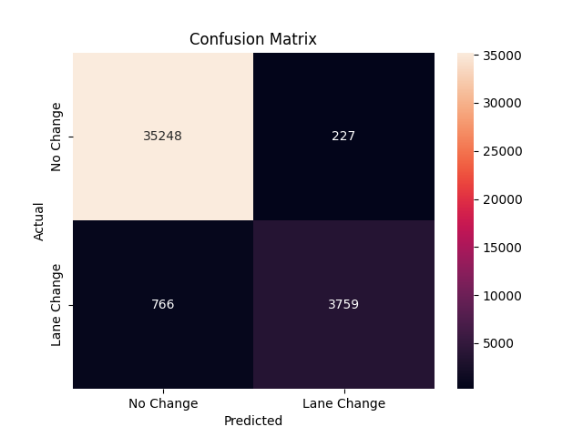
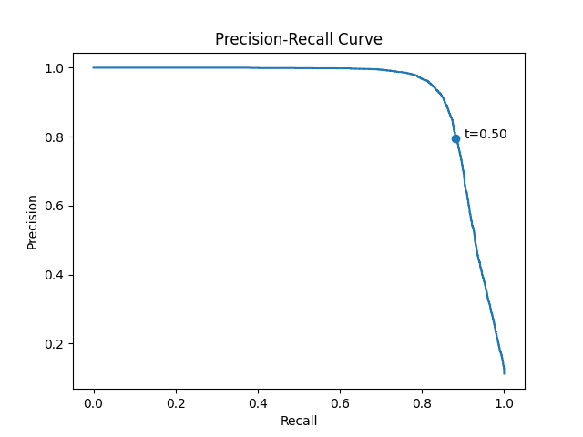

# Lane Change Prediction with ANN

A feedforward neural network trained to predict whether a vehicle will perform a lane change within the next 3 seconds, using real-world highway trajectory data.

---

## Problem Statement

Given recent motion data of a vehicle (position, velocity, acceleration, lane), predict:

**P(lane change within next 3 seconds)**

This is a binary classification problem with significant class imbalance (~11% positive class).

---

## Dataset

**NGSIM I-80 Vehicle Trajectory Dataset** — real-world highway traffic recorded at 10 Hz.

Features per timestep:
- Local X (lateral position)
- Local Y (longitudinal position)
- Velocity (`v_Vel`)
- Acceleration (`v_Acc`)
- Lane ID

Each sample is a **sliding window of 15 timesteps (3 seconds)** flattened into a **75-dimensional input vector**.

---

## Approach

### Preprocessing
- Filtered and cleaned raw trajectory data
- Removed noise in lane-change labels using temporal consistency
- Downsampled from 10 Hz → 5 Hz
- Constructed 15-timestep sliding windows → 75-feature vectors
- Labels: 1 if a lane change occurs within the next 3 seconds, else 0

### Handling Class Imbalance
The dataset is ~89% negative (no lane change). Two strategies were applied:
- **RandomOverSampler** on training data only — duplicates minority class samples to produce a balanced 50/50 training set
- **`BCEWithLogitsLoss`** with `pos_weight=1.0` (balanced after oversampling)

### Model Architecture

```
Input (75)
  → Linear(75 → 64) → ReLU
  → Linear(64 → 32) → ReLU
  → Linear(32 → 1)   [raw logit]
```

- Trained with **Adam** (lr=0.001), **batch size 512**, **30 epochs**
- Decision threshold: **0.5** applied to sigmoid output

---

## Results

| Metric    | ANN (ours) | Logistic Regression |
|-----------|:----------:|:-------------------:|
| Precision |   0.7749   |        0.1400       |
| Recall    |   0.8902   |        0.5341       |
| F1 Score  | **0.8286** |        0.2219       |

The ANN significantly outperforms the logistic regression baseline, demonstrating that the lane-change pattern is non-linear and benefits from learned feature interactions.

---

## Visualisations

**Confusion Matrix**



**Precision-Recall Curve**



---

## Project Structure

```
lane-change-prediction-ann/
├── data/
│   ├── raw/              # original NGSIM dataset (not tracked)
│   └── processed/        # X.npy, y.npy (not tracked)
├── notebooks/
│   ├── 01_data_exploration.ipynb
│   ├── 02_preprocessing.ipynb
│   └── 03_model_training.ipynb
├── src/
│   ├── preprocessing.py  # load, clean, split, normalise, oversample
│   ├── model.py          # LaneChangeModel (PyTorch)
│   └── train.py          # end-to-end training + evaluation script
├── models/
│   └── ann.pt            # saved model weights (not tracked)
├── figures/
│   ├── confusion_matrix.png
│   └── precision_recall_curve.png
├── requirements.txt
└── README.md
```

---

## How to Run

**1. Install dependencies**
```bash
pip install -r requirements.txt
```

**2. Prepare data**

Run the preprocessing notebooks in order, or place `X.npy` and `y.npy` in `data/processed/`.

**3. Train the model**
```bash
python src/train.py
```

This trains the ANN, prints a results table, and saves the model to `models/ann.pt`.

**4. Explore interactively**

Open the notebooks in order:
- `01_data_exploration.ipynb`
- `02_preprocessing.ipynb`
- `03_model_training.ipynb`

---

## Tech Stack

| Library | Purpose |
|---------|---------|
| PyTorch | Neural network training |
| scikit-learn | Logistic regression baseline, metrics |
| imbalanced-learn | RandomOverSampler for class balancing |
| NumPy / Pandas | Data manipulation |
| Matplotlib / Seaborn | Visualisation |

---

## Future Work

- Add early stopping to prevent overtraining
- Experiment with deeper architectures or LSTM for temporal modelling
- Feature engineering: relative motion between vehicles, gap to adjacent lane
- Hyperparameter tuning (learning rate, batch size, architecture depth)
